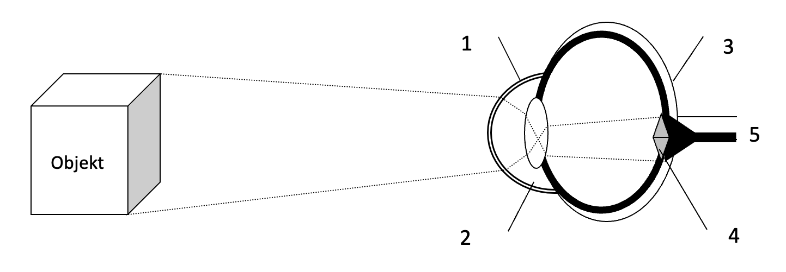
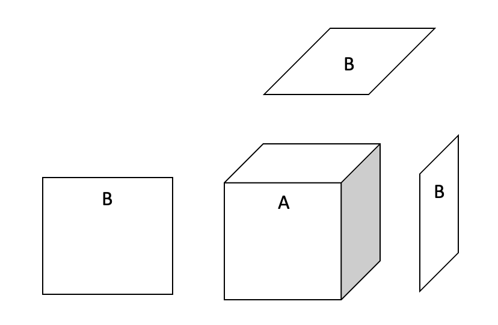
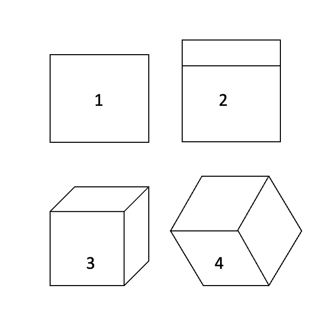

# Sissejatus

- **4D projekti eesmärgiks on kutsuda inimteadvuses esile neljadimensionaalse ruumi nägemistaju.**
- Teoreetiliselt lähtub 4D projekt analüütilisest geomeetriast ja tajuteooriast, mis käsitleb inimese nägemisaistingut.
- 4D projekti tehniliseks baasiks on personaalarvutil põhinev stereovisiooni süsteem.

# Teoreetilised eeldused

## Matemaatiline aspekt

### Elementaar- ja analüütiline geomeetria

Geomeetria vanim osa, nn. _elementaargeomeetria_ tekkis seoses inimese praktiliste vajadustega, nagu maamõõtmine, pindalade ja ruumalade leidmine. Elementaargeomeetria lähtub kolmest põhikujundist ehk algmõistest, mida ei defineerita, vaid mõistetakse intuitiivselt. Need on punkt, sirge ja tasand. Neid põhikujundeid endid ei defineerita, aga nende põhjal defineeritakse kõik teised geomeetrilised kujundid.

Tõsine pööre geomeetria arengus toimus XVII sajandil, mil Descartes ja Fermat panid aluse _analüütilisele geomeetriale_, luues koordinaatide meetodi. Analüütilises geomeetrias on intuitsioon viidud miinimumini: eeldatatakse ainult koordinaatide süsteemi, mille baasil on kõik geomeetrilised kujundid matematiseeritavad ehk taandatavad opereerimisele arvudega (koordinaatidega).

### Neljas dimensioon analüütilises geomeetrias

Geomeetriliseks kujundiks nimetatakse mistahes punktihulka ruumis. Analüütilises geomeetrias määratakse mistahes punkt ruumis tema koordinaatide (reaalarvude) kaudu.

Mistahes punkti koordinaadiks ühedimensionaalses ruumis ehk sirgel on arv X, mis määratakse sel sirgel fikseeritud nullpunkti abil. X võrdub antud punkti kaugusega nullpunktist, mis on positiivne arv, kui see punkt asub nullpunktist ühes suunas, ja negatiivne arv, kui see punkt asub nullpunktist vastupidises suunas. Ühedimensionaalses ruumis asuv mistahes geomeetriline kujund on selle kujundi moodustavate punktide koordinaatide kaudu defineeritav algebraliselt.

Mistahes punkti koordinaadiks kahedimensionaalses ruumis ehk tasandil on kaks arvu X ja Y, mis määratakse kahe nullpunktis ristuva sirge abil, ja mis võrduvad selle punkti ristprojektsioonide kaugustega nullpunktist neil kahel sirgel. Kahedimensionaalses ruumis asuv mistahes geomeetriline kujund on selle kujundi moodustavate punktide koordinaatide kaudu defineeritav algebraliselt.

Mistahes punkti koordinaadid kolmedimensionaalses ruumis on kolm arvu X, Y, Z, mis määratakse kolme nullpunktis omavahel ristuva sirge abil, ja mis võrduvad selle punkti ristprojektsioonide kaugustega nullpunktist neil kolmel sirgel. Kolmedimensionaalses ruumis asuv mistahes geomeetriline kujund on selle kujundi moodustavate punktide koordinaatide kaudu defineeritav algebraliselt.

_Analüütilises geomeetrias on ruumi dimensioon formaalne mõiste. Kujutlus ei oma siin mingit rolli. Ruumi dimensioonide arv taandub selles ruumis asuva punkti koordinaatide arvule. Seega analüütilises geomeetrias on dimensioonide arv lõpmatu. Ja mistahes n-dimensionaalne geomeetriline kujund on koordinaatide meetodil defineeritav algebraliselt._

Mistahes punkti koordinaadid neljadimensionaalses ruumis on neli arvu X, Y, Z, W, mis määratakse nelja nullpunktis omavahel ristuva sirge abil, ja mis võrduvad selle punkti ristprojektsioonide kaugustega nullpunktist neil neljal sirgel. Neljadimensionaalses ruumis asuv mistahes geomeetriline kujund on selle kujundi moodustavate punktide koordinaatide kaudu defineeritav algebraliselt.

## Tajuteoreetiline aspekt

### Nägemise optilis-neuroloogiline mehhanism

Valgus murdub õhu ja sarvkesta (joonisel 1) vahelisel sfäärilisel pinnal ja täiendavalt vikerkesta taga paiknevas silmaläätses (2), tekitades kujutise (4) silma võrkkestale (3).

Valguse (380-780 nm pikkuste elektromagnetlainete) mõjul tekib silma valgustundlikul võrkkestal fotokeemilise protsessi tagajärjel erutus, mis läheb närviimpulsside voona juhteteid (5) kaudu nägemiskeskusse ja muutub analüüsituna nägemisaistinguks.

### Nägemistaju eripära

Nägemise optilis-neuroloogilisest mehhanismist tingitult kannavad närviimpulsid, mis lähevad silma võrkkestast aju nägemiskeskusse, informatsiooni otseselt ainult kahe dimensiooni kohta. Kuid nägemisaisting, mis selle informatsiooni baasil tekib, on kolmedimensionaalne. _Selles seisnebki nägemistaju eripära: kujutis silma võrkkestal on tasapinnaline, kuid inimene näeb ruumiliselt._

Kui inimene tajub kuupi (A), on tema mõlema silma võrkkestal geomeetriline kujutis ainult kolmest rööpkülikust (B).

### Binokulaarne ja monokulaarne stereoskoopiline nägemine

Kuna silmade vaatepunktid on erinevad, tekib kahe silmaga vaadates kummagi silma võrkkestal ruumist oma tasapinnaline kujutis. Aju nägemiskeskus liidab need kaks tasapinnalist kujutist kokku üheks ruumiliseks tervikkujutiseks. Sellist ruumilist nägemist nimetatakse binokulaarseks stereoskoopiliseks nägemiseks. Binokulaarne stereoskoopiline nägemine toimib kõige efektiivsemalt nn. parima nägemise kaugusel, st. juhul kui vaadatav objekt asub silmadest 20-30cm kaugusel. Mida kaugemal on vaadatav objekt, seda vähem erineb tasapinnaline kujutis kahe silma võrkkestal, ja seda nõrgem on binokulaarne stereoskoopiline nägemine.

Kuid inimene tajub selgelt ruumi ka siis, kui ta vaatab kaugemale, ja kui kujutised tema kummagi silma võrkkestal ei erine teineteisest üldse (kino ja TV vaatamine), või kui kujutis on ainult ühe silma võrkkestal (ühe silmaga vaatamine). Kõigil neil juhtudel on sisuliselt tegemist monokulaarse stereoskoopilise nägemisega, mille puhul kujutise ruumilisus on tajutav tasapinnalise kujutise ajalise muutumise alusel.

### Invariant

Monokulaarse stereoskoopilise nägemise baasiks on kolmedimensionaalse objekti kahedimensionaalne projektsioon silma võrkkestal. Kahemõõtmelise projektsiooni ajalisel muutumisel taastub tajus kolmas dimensioon. Silmad “näevad” muutuvat tasapinnalist kujutist, kuid taju “näeb” neis tasapinnalistes muutustes kolmedimensionaalset invariantsust, st. muutuvad kahedimensionaalsed kujutised on tajutavad kui muutumatu kolmedimensionaalne objekt erinevatest vaatenurkadest vaadatuna.

Näiteks need erinevad tasapinnalised kujutised: (1) ruut, (2) kaks ristkülikut, (3) ruut ja kaks rööpkülikut, (4) kolm rombi on tajutavad kui pöörlev invariantne kolmemõõtmeline objekt – kuup.

Invariandi taju on väga selge. Näiteks kui 3D objekt pööreldes deformeerub, on tema muutuva tasapinnalise projektsiooni põhjal selgelt tajutav, et 3D invariant on rikutud. Invariandi taju on automaatne. Näiteks on peaaegu võimatu tajuda 2D kinopilti tasapinnalisena, sest taju taastab 2D muutuste alusel automaatselt kolmanda dimensiooni.

Tajus ilmneb invariant kogemusliku lisadimensioonina. Matemaatiliselt defineeritakse invariant järgmiselt: geomeetrilise kujundi moodustavate punktide konfiguratsioon säilib, kuid koordinaadid muutuvad.

# Tehniline baas

## Kunstlik stereoskoopiline nägemine

_Kunstlik stereoskoopiline nägemine on binokulaarne stereoskoopiline nägemine, mis kutsutakse esile tehnilisi vahendeid kasutades._ Selle tehniliselt kõige lihtsam variant on stereofotograafia.

Stereofotograafias pildistatakse üht objekti korraga kahest veidi erinevast vaatenurgast. Neid kahte vaatenurgalt veidi erinevat fotot vaadatakse vastava seadme ehk stereoskoobi abil nii, et vasak silm näeb vasakpoolset, parem silm parempoolset fotot. Nii tekib nagu loomuliku binokulaarse stereoskoopilise nägemisegi puhul kummagi silma võrkkestal objektist veidi erinev tasapinnaline kujutis. Aju nägemiskeskus liidab need kaks tasapinnalist kujutist kokku üheks ruumiliseks tervikkujutiseks.

Stereokinematograafias filmitakse üht objekti korraga kahest veidi erinevast vaatenurgast. Need vaatenurgalt veidi erinevad filmid projekteeritakse korraga teatud erilisel viisil kinolinale nii, et spetsiaalseid filtreid-prille kasutav vaataja näeb ühe silmaga üht, teise silmaga teist filmi. Nii tekivad jälle nagu loomuliku binokulaarse nägemisegi puhul kummagi silma võrkkestale objektist erinevad tasapinnalised kujutused, mis tajus liituvad ruumiliseks nägemisaistinguks.

4D projektis kasutatakse personaalarvutil põhinevat kunstliku stereoskoopilise nägemise tehnilist süsteemi.

Kui stereofotograafias ja –kinematograafias üksnes jäädvustatakse stereograafiliselt kujutisi reaalsest maailmast, siis personaalarvutil põhinev stereovisiooni süsteem võimaldab luua (programmeerida) virtuaalseid stereoskoopilisi kujutisi. Ja just sellel võimalusel põhinebki 4D projekt.

## Personaalarvutil põhinev stereovisiooni süsteem

PC-l põhinev stereovisiooni süsteem koosneb spetsiaalsest tarkvarast, spetsiaalsest videokaardist ja sellega (juhtmega või juhtmeta) ühendatud spetsiaalsetest prillidest.

Selle süsteemi puhul kutsutakse binokulaarne stereoskoopiline nägemine kunstlikult esile seeläbi, et monitoril näidatakse kiiresti-vaheldumisi kaht veidi erineva vaatepunktiga pilti, ja samas taktis suletakse prillidel vaheldumisi vasak-parem nägemisava. Nii saavutatakse jällegi olukord, kus kummagi silma võrkkestale ilmuvad vaatepunktilt veidi erinevad tasa-pinnalised kujutised, mille aju või hing liidab automaatselt üheks ruumiliseks nägemisaistinguks.

# 4D Projekt

## Idee

Me oleme võimelised tajuma kolmedimensionaalset kujutist selle kahedimensionaalse projektsiooni alusel. Aga kas ei võiks siis analoogia põhjal arvata, et me oleme võimelised tajuma ka neljadimensionaalset kujutist selle kolmedimensionaalse projektsiooni alusel? Ehk teisisõnu: kuna aju või hing suudab kahedimensionaalsest muutuvast kujutist analüüsides tuvastada, kui tegemist on kolmedimensionaalse objekti projektsiooniga, st. kuna aju või hing tunneb ära 3D-invariandi 2D-kujutise muutumises ja taastab selle põhjal tajus selgelt ja automaatselt kolmanda dimensiooni, siis pole välistatud, et aju või hing suudab ära tunda ka 4D-invariandi 3D-kujutise muutumises ja kutsuda selle põhjal esile neljadimensionaalse nägemisaistingu. See ei tarvitse tingimata nii olla, aga võib olla. Pole mingit mõjuvat põhjust, miks peaks arvama, et see on võimatu. Analoogia põhjal tundub see olevat tõenäoline (vt. tabel all). **Kindlasti on see piisavalt tõenäoline, et väärida katsetamist.**

|                             | **_Reaalne loomulik monokulaarne 3D nägemine_** | **_Hüpoteetiline kunstlik 4D nägemine_**       |
| --------------------------- | ----------------------------------------------- | ---------------------------------------------- |
| Baasinfo ajus               | Muutuv 2D nägemispilt, mis on 3D projektsioon.  | Muutuv 3D nägemispilt, mis on 4D projektsioon. |
| Aju töötleb seda infot ja … | tunneb 2D muutustes ära 3D invariantsuse.       | tunneb 3D muutustes ära 4D invariantsuse.      |
| Aju kutsub tajus esile      | 3D invariantsuse alusel 3D nägemisaistingu.     | 4D invariantsuse alusel 4D nägemisaistingu.    |

_4D projekti põhimõtteline idee seisnebki selles, et kunstlikult luua muutuv binokulaarne stereoskoopiline (3D) nägemispilt, mis oleks matemaatiliselt neljadimensionaalse objekti projektsioon, ja katsetada, kas meie aju või hing tunneb selles 3D muutuvas kujutises ära 4D invariantsuse, taastades selle põhjal tajus neljanda dimensiooni, nii et meile saab osaks neljadimensionaalne nägemisaisting (kuidas iganes see ka välja näeb?!)._

## Teostus

Üks kõige primitiivsem programm, mis võimaldab stereoskoopiliselt näha muutuvat kolmedimensioonilist kujundit, mis on neljadimensionaalse kujundi projektsioon kolmruumi, näeb näiteks Qbasic'us välja nii: (vaata _Lisa.)_ Seda programmi saab teistes keeltes oluliselt edasi arendada.

Kui programm on valmis, siis ei ole muud kui tuleb keskenduda, vaadata ja oodata, kas nägemisaisting muutub. Muud katsed nägemisaistinguga lasevad oletada, et muutust ei tasu loota enne paari nädalat pidevat katsetamist; ja kui muutust ei tulekuu ajaga, siis ei tule seda tõenäoliselt üldse.
